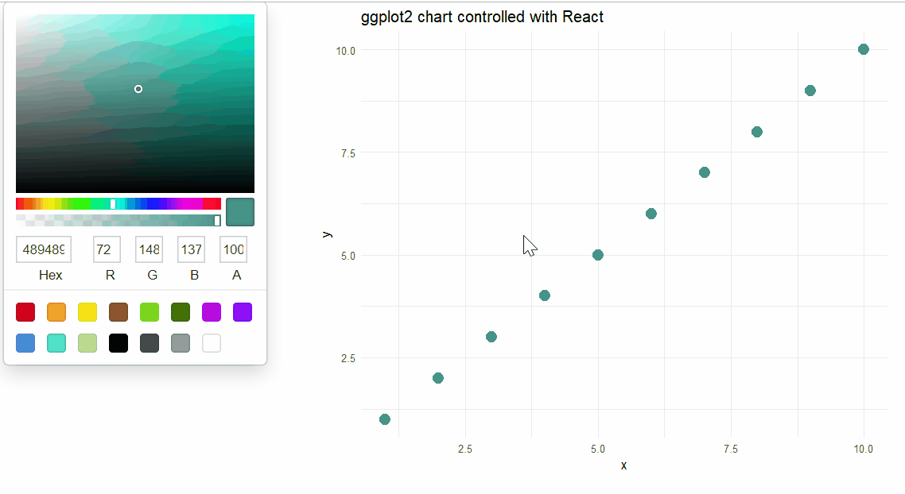

class: inverse, right, title-slide, middle

<style>
.title-slide .remark-slide-number {
  display: none;
}
</style>

# R + JavaScript

## Introducing reactR

### Kent Russell

<h3><a style = 'color:gray;' href='https://github.com/timelyportfolio'>@timelyportfolio</a></h3>

### 2016/04/19

<a href="https://github.com/timelyportfolio/react_bham_lunch_learn_reactR" class="github-corner" aria-label="View source on Github"><svg width="80" height="80" viewBox="0 0 250 250" style="fill:#fff; color:#151513; position: absolute; top: 0; border: 0; right: 0;" aria-hidden="true"><path d="M0,0 L115,115 L130,115 L142,142 L250,250 L250,0 Z"></path><path d="M128.3,109.0 C113.8,99.7 119.0,89.6 119.0,89.6 C122.0,82.7 120.5,78.6 120.5,78.6 C119.2,72.0 123.4,76.3 123.4,76.3 C127.3,80.9 125.5,87.3 125.5,87.3 C122.9,97.6 130.6,101.9 134.4,103.2" fill="currentColor" style="transform-origin: 130px 106px;" class="octo-arm"></path><path d="M115.0,115.0 C114.9,115.1 118.7,116.5 119.8,115.4 L133.7,101.6 C136.9,99.2 139.9,98.4 142.2,98.6 C133.8,88.0 127.5,74.4 143.8,58.0 C148.5,53.4 154.0,51.2 159.7,51.0 C160.3,49.4 163.2,43.6 171.4,40.1 C171.4,40.1 176.1,42.5 178.8,56.2 C183.1,58.6 187.2,61.8 190.9,65.4 C194.5,69.0 197.7,73.2 200.1,77.6 C213.8,80.2 216.3,84.9 216.3,84.9 C212.7,93.1 206.9,96.0 205.4,96.6 C205.1,102.4 203.0,107.8 198.3,112.5 C181.9,128.9 168.3,122.5 157.7,114.1 C157.9,116.9 156.7,120.9 152.7,124.9 L141.0,136.5 C139.8,137.7 141.6,141.9 141.8,141.8 Z" fill="currentColor" class="octo-body"></path></svg></a><style>.github-corner:hover .octo-arm{animation:octocat-wave 560ms ease-in-out}@keyframes octocat-wave{0%,100%{transform:rotate(0)}20%,60%{transform:rotate(-25deg)}40%,80%{transform:rotate(10deg)}}@media (max-width:500px){.github-corner:hover .octo-arm{animation:none}.github-corner .octo-arm{animation:octocat-wave 560ms ease-in-out}}</style>

---
class: left, middle

```{r setup, include=FALSE}
options(htmltools.dir.version = FALSE)
library(leaflet)
library(htmltools)
library(reactR)
library(roffice)
```

```{r xaringan-themer, include = FALSE}
library(xaringanthemer)
mono_accent(
  base_color = "#3a6579",
  header_font_family = "Public Sans Regular",
  header_h3_font_size = "28px",
  text_font_family   = "Public Sans Light",
  code_font_family   = "Fira Code",
  link_color = "#8796a3"
)
# solarized_light()
```


# Why R?

### Language of data science (*Python works too*)
### Open and cross-platform
### Confirmed usage at Google, Facebook, Uber, Microsoft, Twitter, Netflix, Airbnb, New York Times, Financial Times, ...
### Integrates with other programming languages
### Best, most feature-complete charting and graphics
### Friendly, nice, and welcoming community

---
class: left, middle, inverse

# What if you want to do Data Science in JavaScript?


### [Learn JS Data](http://learnjsdata.com/)
### [Simple Statistics](https://simplestatistics.org/)
### [Tensorflow.js](https://www.tensorflow.org/js)
### [Rjs](https://github.com/R-js) - "... re-writing the R language to the browser and node"

---
class: left, middle

# What if you want to do Web with R?


### [opencpu](https://www.opencpu.org/) - http API based on R
### [plumber](https://www.rplumber.io/) - web API from R code
### [rmarkdown](https://rmarkdown.rstudio.com/) - markdown + R + other languages
### [Shiny](https://shiny.rstudio.com/) - reactive, interactive web apps from R
### [htmlwidgets](http://htmlwidgets.org) - wrap HTML/JS/CSS for use in R
### [rvest](https://github.com/tidyverse/rvest) - web scraping for R
### [V8](https://cran.r-project.org/web/packages/V8/vignettes/v8_intro.html) - embedded V8 for R

---
class: top, left

# What Does R Look Like?

.pull-left[
## JavaScript

```js
[1,2,3]
```

```js
{
  x: "string",
  y: true
}
```

```js
function(x) { return x+2 }
```
]

.pull-right[
## R

```{r eval = FALSE}
c(1,2,3)
```

```{r eval = FALSE}
list(
  x = "string",
  y = TRUE
)
```

```{r eval = FALSE}
function(x) { return(x+2) }
```
]

---
class: top, left

# R + JS | htmlwidget

```{r out.width='100%', fig.height=4.5}
library(leaflet)
leaflet() %>%
  addTiles() %>%
  setView(-86.786324, 33.5141587, zoom = 17)
```


---
class: top, left

# R + JS | now with React !!

<div style="text-align:right"><a href = "https://developer.microsoft.com/en-us/fabric/#/components"><code>office-ui-fabric-react<code/></a> React components</div>

[`roffice`](https://github.com/react-R/roffice) R package

.pull-left[
```{r}
officeuiwidget(
  React$Slider(
    label = "a slider",
    min = 1,
    max = 5,
    step = 1,
    defaultValue = 2,
    showValue = TRUE
  )
)
```
]

.pull-right[
```js
<Slider
  label="a slider"
  min={1}
  max={5}
  step={1}
  defaultValue={2}
  showValue={true}
/>
```
]
---
class: top, left


```{r}
officeuiwidget( React$DatePicker() )
```

```{r}
officeuiwidget( 
  React$CommandBar(
    items = list(
      list(
        key = 'upload', name = 'Upload',
        iconProps = list(iconName = 'Upload')
      ),
      list(
        key = 'share', name = 'Share',
        iconProps = list(iconName = 'Share')
      )
    )
  )
)
```

---
class: top, left

## R + React in a Shiny App




---
class: left, top
background-image: url("python-logo-master-v3-TM.png")

# What about ?

---
class: middle, center

# See [dash](https://plot.ly/products/dash/) from Plotly


---
class: top, left

# Thanks, Attribution

[RStudio](https://rstudio.org)

[React Authors](https://github.com/facebook/react/blob/master/AUTHORS)

[remark.js](https://github.com/gnab/remark)

[xaringan](https://github.com/yihui/xaringan) by Yihui Xie

[xaringanthemer](https://github.com/gadenbuie/xaringanthemer) by Garrick Aden-Buie

[@alandipert](https://github.com/alandipert) for brilliant work on `reactR`

